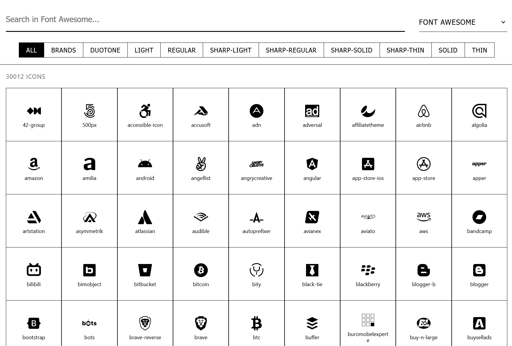

# SVG Icon Browser

A modern, fast, and responsive web application for browsing, searching, and managing large collections of SVG icons. Built with React, TypeScript, and Vite.



## ✨ Features

- 🔍 **Fast Search**: Fuzzy search with debouncing for instant results
- 📱 **Responsive Design**: Works seamlessly on desktop, tablet, and mobile
- 🎨 **Collection Support**: Browse multiple icon collections (Font Awesome, Huge Icons, etc.)
- 🏷️ **Smart Filtering**: Filter by style (solid, outline, bulk) and categories
- ⚡ **Virtualized Rendering**: Smooth performance with thousands of icons
- 📋 **Copy & Download**: One-click copy SVG code or download files
- 🎯 **Lazy Loading**: Only loads data for selected collections
- 🌟 **Clean UI**: Minimalist white theme with intuitive navigation

## 🚀 Demo

[Live Demo](your-demo-url-here) | [Video Demo](your-video-url-here)

## 📁 Supported Icon Collections

- **Font Awesome**: Complete collection with solid, regular, light, and brand styles
- **Huge Icons**: Comprehensive icon set with outline, solid, and bulk variants
- **Custom Collections**: Easy to add your own icon collections

## 🛠️ Installation

### Prerequisites

- Node.js 16+
- PNPM (recommended) or npm/yarn

### Quick Start

1. **Clone the repository**

   ```bash
   git clone https://github.com/yourusername/svg-icon-browser.git
   cd svg-icon-browser
   ```

2. **Install dependencies**

   ```bash
   pnpm install
   ```

3. **Add your icon collections**
   Place your SVG icon collections in the `src/assets/icons/` directory:

   ```
   src/assets/icons/
   ├── font-awesome/
   │   ├── solid/
   │   │   ├── category1/
   │   │   └── category2/
   │   └── outline/
   └── huge/
       ├── arrows/
       │   ├── solid/
       │   ├── outline/
       │   └── bulk/
       └── business/
   ```

4. **Build the icon index**

   ```bash
   node scripts/build-icons.mjs
   ```

5. **Start the development server**

   ```bash
   pnpm dev
   ```

6. **Open your browser**
   Navigate to `http://localhost:5173`

## 📂 Project Structure

```
├── src/
│   ├── components/           # React components
│   │   ├── IconBrowser.tsx   # Main browser component
│   │   ├── IconGrid.tsx      # Virtualized icon grid
│   │   ├── IconModal.tsx     # Icon detail modal
│   │   └── Sidebar.tsx       # Filter sidebar
│   ├── assets/icons/         # Your SVG icon collections
│   ├── lib/                  # Utilities and types
│   └── data/                 # Generated icon data
├── scripts/
│   └── build-icons.mjs       # Icon indexing script
└── public/                   # Static assets
```

## 🔧 Configuration

### Adding New Icon Collections

1. Create a new folder in `src/assets/icons/` with your collection name
2. Organize icons in one of these supported structures:
   - **Style → Category**: `collection/style/category/icon.svg`
   - **Category → Style**: `collection/category/style/icon.svg`
3. Run the build script: `node scripts/build-icons.mjs`

### Customizing the UI

The application uses CSS custom properties for theming. Modify variables in `src/index.css`:

```css
:root {
  --color-primary: #2563eb;
  --color-secondary: #64748b;
  --color-background: #ffffff;
  /* ... more variables */
}
```

## 🏗️ Build for Production

```bash
# Build the application
pnpm build

# Preview the production build
pnpm preview
```

## 📊 Performance

- ⚡ Handles 30,000+ icons smoothly
- 🚀 Lazy loading reduces initial bundle size
- 💨 Virtualized rendering for optimal performance
- 🔍 Sub-100ms search response times

## 🤝 Contributing

We welcome contributions! Please see our [Contributing Guidelines](CONTRIBUTING.md) for details.

### Development Setup

1. Fork the repository
2. Create a feature branch: `git checkout -b feature/amazing-feature`
3. Make your changes
4. Add tests if applicable
5. Commit your changes: `git commit -m 'Add amazing feature'`
6. Push to the branch: `git push origin feature/amazing-feature`
7. Open a Pull Request

### Code Style

- Use TypeScript for type safety
- Follow React best practices
- Use meaningful component and variable names
- Add comments for complex logic

## 📝 License

This project is licensed under the MIT License - see the [LICENSE](LICENSE) file for details.

## 🙏 Acknowledgments

- [Font Awesome](https://fontawesome.com/) - Icon collection
- [Huge Icons](https://hugeicons.com/) - Icon collection
- [Fuse.js](https://fusejs.io/) - Fuzzy search library
- [React Virtual](https://tanstack.com/virtual) - Virtualization library
- [Vite](https://vitejs.dev/) - Build tool

## 📞 Support

- 🐛 [Report a Bug](https://github.com/yourusername/svg-icon-browser/issues)
- 💡 [Request a Feature](https://github.com/yourusername/svg-icon-browser/issues)
- 💬 [Discussions](https://github.com/yourusername/svg-icon-browser/discussions)

## 📈 Roadmap

- [ ] Dark theme support
- [ ] Icon favoriting system
- [ ] Bulk download functionality
- [ ] API for programmatic access
- [ ] Plugin system for custom icon sources
- [ ] Advanced filtering options

---

Made with ❤️ by [Your Name](https://github.com/yourusername)
