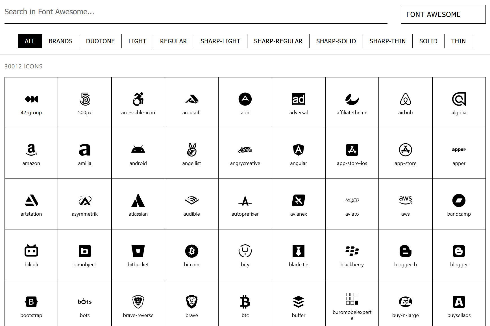

# Mixxicon

A modern, fast, and responsive icon browser for managing large collections of SVG icons. Built with React, TypeScript, and Vite.



## Features

- **🔍 Fast Search** - Fuzzy search with instant results
- **📱 Responsive** - Works on all devices
- **🎨 Multi-Collection** - Font Awesome, Huge Icons, and more
- **🏷️ Smart Filters** - By style and category
- **⚡ High Performance** - Virtualized rendering for 30,000+ icons
- **📋 Easy Export** - Copy SVG or download files
- **🌟 Clean UI** - Minimalist design

## Quick Start

### Prerequisites

- Node.js 16+
- PNPM

### Installation

```bash
# Clone repository
git clone https://github.com/yngpiu/mixxicon.git
cd mixxicon

# Install dependencies
pnpm install

# Build icon index
node scripts/build-icons.mjs

# Start development server
pnpm dev
```

Open `http://localhost:5173` in your browser.

## Project Structure

```
src/
├── components/          # React components
│   ├── Header.tsx       # Navigation header
│   ├── IconGrid.tsx     # Virtualized grid
│   └── IconModal.tsx    # Icon details
├── assets/icons/        # SVG collections
├── lib/                 # Utilities & types
scripts/
└── build-icons.mjs      # Icon indexing
public/                  # Generated data
```

## Adding Icon Collections

1. Add SVG files to `src/assets/icons/`:

   ```
   src/assets/icons/
   ├── collection-name/
   │   ├── style/category/icon.svg
   │   └── category/style/icon.svg
   ```

2. Rebuild index:
   ```bash
   node scripts/build-icons.mjs
   ```

## Build & Deploy

```bash
# Production build
pnpm build

# Preview build
pnpm preview
```

## License

MIT License - see [LICENSE](LICENSE) file.

## Links

- [Live Demo](https://mixxicon.netlify.app/)
- [Report Issues](https://github.com/yngpiu/mixxicon/issues)
- [Font Awesome](https://fontawesome.com/)
- [Huge Icons](https://hugeicons.com/)

---

Made with ❤️ by Yngpiu
